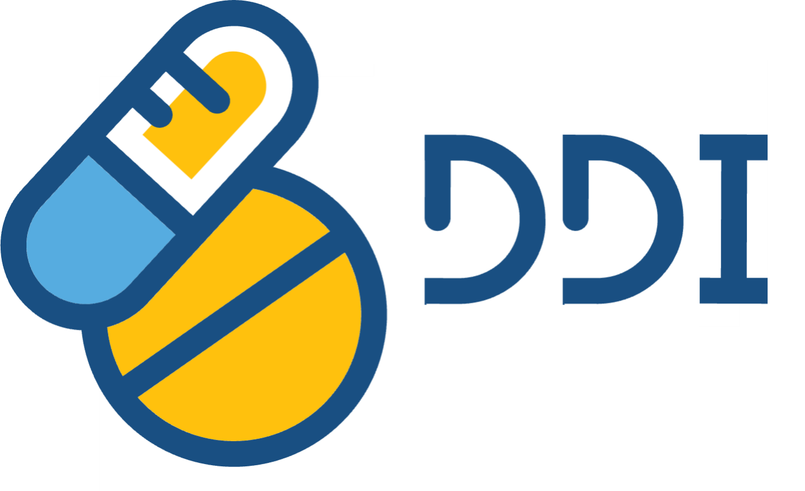
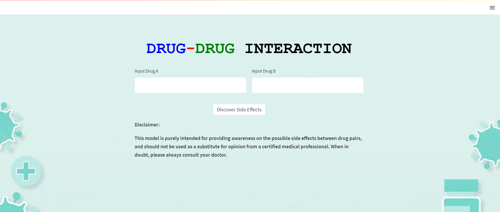
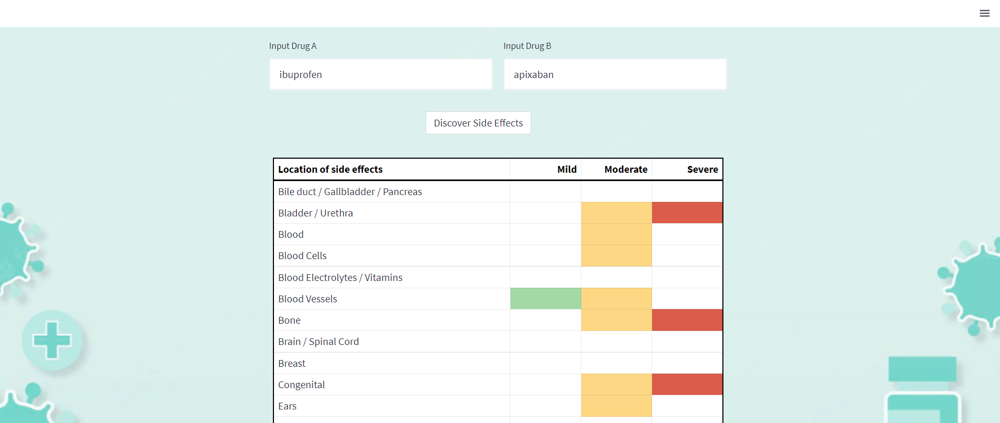

# DDI: A drug-drug interaction side effect predictor

## Predicting polypharmacy side effects of drug pairs
- Objective: The objective of this project is to predict accurately all polypharmacy side effects given any drug pair, using only the SMILES strings of the drugs.
  > Polypharmacy side effect: unwanted symptoms due to a combination of drugs, and cannot be attributed to the individual drugs at the same concentration.
- Data source: TWOSIDES dataset from [Therapeutic Drug Commons](https://tdcommons.ai/multi_pred_tasks/ddi/)
  - The TWOSIDES dataset was derived from adverse event reports that were compiled from various adverse event reporting systems (AERS) and then processed by Tatonetti _et. al._ (2012) to remove any biases, errors, duplicates and non-significant associations
  - Contains about 4.7 million rows of drug pairs and the corresponding reported polypharmacy side effects
- Type of analysis: Multilabel classification
- Key models used: Random Forest Classifier, Multi Output Classifier
- Key packages used: Scikit-learn, Mordred, RDKit
- Contributors: [Chong Xin Er](https://github.com/chongxe1991), [George Lee](https://github.com/Georgejkl5), [Marcus Tan](https://github.com/marcustan-94), [Zheng Yong Shun](https://github.com/zyongshun)

## Step 1 - Side effect reclassification
As there are **1,317 side effects** associated with drug pairs in the TWOSIDES dataset, we first reclassified the side effects into **85 classes**, based on an anatomical schema, as well as by severity, so it is less computationally intensive to work on. We made references to two papers [(Lavertu et. al., 2021)](https://pubmed.ncbi.nlm.nih.gov/34673524/) and [(Gottlieb et. al., 2015)](https://pubmed.ncbi.nlm.nih.gov/25800813/) when classifying the side effects based on severity. For those side effects that were not found in those papers, they were then classified manually based on our understanding and interpretation of the severity of the side effects.

## Step 2 - Feature engineering
Using RDKit and Mordred, we engineered over **700 molecular features** from the SMILES strings of each drug. Therafter, for each drug pair in the TWOSIDES dataset, the values of the features of drug A were subtracted from the values of the features of drug B. The reason for doing this is twofold:
- If Drug A interacts with Drug B and results in a polypharmacy side effect, this could be because Drug A is very similar to Drug B with regards to certain features (and hence differencing those particular features will result in values close to 0), or because Drug A is completely opposite to Drug B with regards to other features (resulting in a large value after differencing those particular features). Hence the magnitude of these differenced features can be used to predict the possible polypharmacy side effects of a given drug pair
- If Drug A interacts with Drug B and results in a polypharmacy side effect, and Drug C has very similar features with Drug B, then it is very likely that Drug A will also interact with Drug C to result in the same polypharmacy side effect. The values of the differenced features for Drug A - Drug B pair will therefore be very similar to that of Drug A - Drug C pair, and thus we can use these differenced features to make our predictions

## Step 3 - Model training
After performing cleaning, preprocessing and splitting of the TWOSIDES dataset into train and test sets, we employed **Principal Component Analysis** on the train set to reduce the dimensionality of the dataset by selecting sufficient principal components that explains 80% of the variation in the dataset and that number is 46.

Next, we ran the train set through a **multilabel Random Forest Classifier** model and tuned the hyperparameters of the model using a **random grid search** approach to give us a range that may contain the best hyperparemeters. Next, we used the normal **grid search** to narrow the search. Finally, we validated the results of the search using the test set.

From there, the optimal hyperparameters were selected (disclaimer: the optimal number of estimators for the Random Forest model was 150 but we used 20 estimators instead to reduce the filesize of the model) and the model was retrained using the full TWOSIDES dataset. We managed to achieve an accuracy of 74.8%.

## Step 4 - Model deployment
The model and relevant code were packaged into a web application using **Streamlit**, and deployed using **Heroku**. The link to the web application is as follows: [https://ddi-lewagon.herokuapp.com/](https://ddi-lewagon.herokuapp.com/)

In the user interface, the user is prompted to input the name of the two drugs:

The SMILES strings of these two drugs were fetched through a [chemical identifier API](https://cactus.nci.nih.gov/chemical/structure) and then fed into the model for prediction. The model then outputs a list of possible side effects (identified by the green, orange and red coloured boxes), categorised by location and severity.

## Future improvements
- Retrain the model using additional features such as the drug's pharmacokinetic and pharmacodynamic properties, and its target receptors, and hopefully push the model accuracy to over 90%
- Predict the chances of each side effect happening, instead of just outputting whether a side effect may occur or not
- Run the model against all 1,317 side effects (i.e. no reclassification of side effects)

## Disclaimer
- The model currently outputs a list of all possible side effects that may occur with the given drug pair. It **does not** predict the possibility of each side effect happening. Therefore, please do not be alarmed if you see that a given drug pair has a huge list of polypharmacy side effects, as the chances of these side effects happening may be extremely low. **Do not** make your own decision to stop taking certain medications based on these results, without obtaining approval from the doctor.
- This model is purely intended for providing awareness on the possible side effects between drug pairs, and should not be used as a substitute for opinion from a certified medical professional. When in doubt, please always consult your doctor.

## Github Directory
- There are two files that are not uploaded into Github as their file sizes are too big. These are the twosides.csv and model.joblib
- The twosides.csv can be converted from the TWOSIDES dataset, that is located in [Therapeutic Drug Commons](https://tdcommons.ai/multi_pred_tasks/ddi/).
- The model.joblib can be trained using param_search.py, however a disclaimer that this will take hours to generate the model.joblib that is more than 10gb in file size. Alternatively, in the Github heroku branch, we have uploaded a simplified model.joblib that uses a Decision Tree Classifier model instead, and this model has an accuracy of 69.1%.

## Acknowledgements
Special thanks to [Ahmed T. Hammad](https://github.com/athammad) for providing invaluable feedback, giving encouragement, guiding us through the project and making all of this possible. Thank you [Le Wagon](https://www.lewagon.com/singapore) as well, for providing us with the necessary resources and equipping us with the relevant knowledge and skills.

## References
> Tatonetti N.P., Ye P.P., Daneshjou R. and Altman R.B. (2012). Data-driven prediction of drug effects and interactions. Sci Transl Med, 4(125). doi: 10.1126/scitranslmed.30033.

> Gottlieb A., Hoehndorf R., Dumontier M. and Altman R.B. (2015). Ranking adverse drug reactions with crowdsourcing. J Med Internet Res, 17(3):e80. doi: 10.2196/jmir.3962.

> Lavertu A., Hamamsy T. and Altman R.B. (2021). Quantifying the severity of adverse drug reactions using social media: network analysis. J Med Internet Res, 23(10):e27714. doi: 10.2196/27714.
